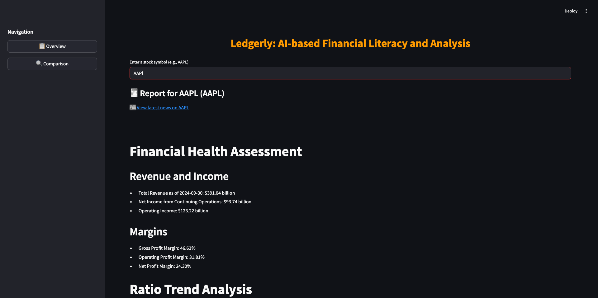

# 📘 Ledgerly  
**Your Friendly AI for Financial Literacy**

---

## Conversational Financial Analysis

**Ledgerly** is an AI-powered educational tool designed to make **financial data understandable to everyone** — from students to small business owners. It transforms complex financial reports into conversational summaries using GPT-based analysis, helping users build confidence in interpreting balance sheets, ratios, and trends.

You can explore the financial health of real companies using public data, ask questions, and view visual breakdowns of key metrics — all in a low-barrier, interactive format.

---

## AI-Driven Explanations

Ledgerly offers a **step-by-step financial breakdown** of companies by integrating:

- 📊 Key financial metrics (e.g., revenue, income, margins)
- 📈 Time-series stock prices
- 🧮 Ratio analysis (liquidity, profitability, solvency)
- 💬 AI-generated natural language explanations

These outputs help bridge the gap between raw data and real understanding.

---

## 1. Role of Ledgerly in Education

This tool is designed to:

- Teach how to interpret financial reports in plain English
- Train early learners on core accounting and finance concepts
- Provide simplified AI feedback on any public company
- Support educators by acting as an explainer and visualizer
- Encourage financial self-education for non-experts

---

## 2. Learning with Ledgerly

### 1. Choose a Company  
Search for a public company by ticker symbol (e.g., `AAPL`, `MSFT`).

### 2. Review the AI Summary  
Understand:
- What is the company earning?
- Are they profitable?
- How are they managing debt?

### 3. Break Down the Metrics  
You’ll learn:
- The meaning of gross/operating/net income
- How ratios like ROE or current ratio reflect health
- What changes in revenue or margin indicate

### 4. Explore Charts  
Time-series charts and bar graphs reinforce:
- Stock price behavior over time
- Visual comparison of income elements
- Trendlines in key ratios

---

## Ledgerly Guidelines

### 1. Read the Financial Report Summary  
The AI will walk you through the company’s financial story.

### 2. Learn Key Terms in Context  
Don’t worry if you don’t know terms like “EBITDA” or “debt-to-equity” — Ledgerly explains them via example.

### 3. Use Comparison Mode to Understand Contrasts  
By comparing two companies, you can see what makes one healthier than another.

### 4. Ask: What’s Driving Change?  
If revenue dropped — why? If ROE rose — is it good or risky?

### 5. Interpret, Don’t Memorize  
Use Ledgerly not to memorize definitions, but to understand **how numbers reflect business performance.**

---

## 2 Use Cases for Learning

### 1. 📘 Beginner Finance Students  
Get instant summaries of textbook financial terms applied to real companies.

### 2. 🧾 Small Business Owners  
Upload simplified balance sheets (coming soon) to get personalized interpretation of your financial health.

---

## 3 Structure of Financial Analysis

Ledgerly structures its insights around:

### A. Income Statement Basics  
- Revenue  
- Operating Income  
- Net Income

### B. Ratios  
- Profitability (Net Margin, ROE)  
- Liquidity (Current Ratio)  
- Leverage (Debt/Equity)

### C. Stock Trend Behavior  
- Visual closing price charts  
- Short-term vs long-term views

### D. GPT Summary  
- Educational explanation of all above  
- Investment-style recommendation for context

## Sample Snapshot from the Application

---

## Future Enhancements

- 📥 CSV upload for personal or mock data
- 🗣️ Multilingual support for non-English users
- 🧠 Financial term glossary
- 📊 PDF report export for students or case studies

---

## Contributing / Adapting

Ledgerly can be adapted for:

- Non-profit financial literacy campaigns
- Open-access student tools
- Interactive workshops or bootcamps

If you’d like to collaborate or use this tool, please contact us!

---